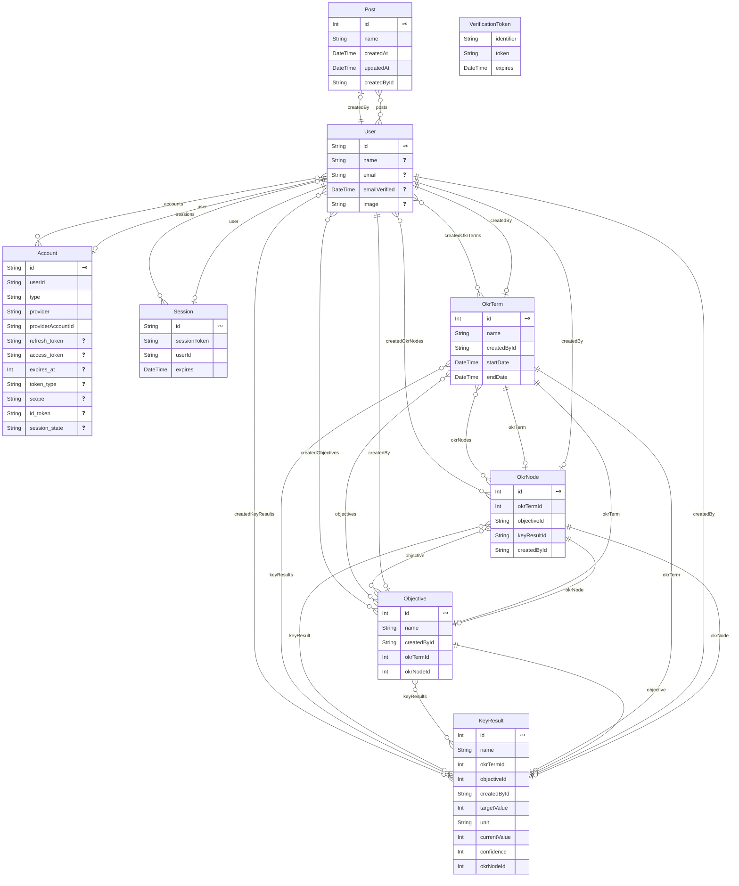

```mermaid
erDiagram

  "Post" {
    Int id "🗝️"
    String name 
    DateTime createdAt 
    DateTime updatedAt 
    String createdById 
    }
  

  "Account" {
    String id "🗝️"
    String userId 
    String type 
    String provider 
    String providerAccountId 
    String refresh_token "❓"
    String access_token "❓"
    Int expires_at "❓"
    String token_type "❓"
    String scope "❓"
    String id_token "❓"
    String session_state "❓"
    }
  

  "Session" {
    String id "🗝️"
    String sessionToken 
    String userId 
    DateTime expires 
    }
  

  "User" {
    String id "🗝️"
    String name "❓"
    String email "❓"
    DateTime emailVerified "❓"
    String image "❓"
    }
  

  "VerificationToken" {
    String identifier 
    String token 
    DateTime expires 
    }
  

  "OkrTerm" {
    Int id "🗝️"
    String name 
    String createdById 
    DateTime startDate 
    DateTime endDate 
    }
  

  "OkrNode" {
    Int id "🗝️"
    Int okrTermId 
    String objectiveId 
    String keyResultId 
    String createdById 
    }
  

  "Objective" {
    Int id "🗝️"
    String name 
    String createdById 
    Int okrTermId 
    Int okrNodeId 
    }
  

  "KeyResult" {
    Int id "🗝️"
    String name 
    Int okrTermId 
    Int objectiveId 
    String createdById 
    Int targetValue 
    String unit 
    Int currentValue 
    Int confidence 
    Int okrNodeId 
    }
  
    "Post" o|--|| "User" : "createdBy"
    "Account" o|--|| "User" : "user"
    "Session" o|--|| "User" : "user"
    "User" o{--}o "Account" : "accounts"
    "User" o{--}o "Session" : "sessions"
    "User" o{--}o "Post" : "posts"
    "User" o{--}o "OkrTerm" : "createdOkrTerms"
    "User" o{--}o "OkrNode" : "createdOkrNodes"
    "User" o{--}o "Objective" : "createdObjectives"
    "User" o{--}o "KeyResult" : "createdKeyResults"
    "OkrTerm" o|--|| "User" : "createdBy"
    "OkrTerm" o{--}o "OkrNode" : "okrNodes"
    "OkrTerm" o{--}o "Objective" : "objectives"
    "OkrTerm" o{--}o "KeyResult" : "keyResults"
    "OkrNode" o|--|| "OkrTerm" : "okrTerm"
    "OkrNode" o{--}o "Objective" : "objective"
    "OkrNode" o{--}o "KeyResult" : "keyResult"
    "OkrNode" o|--|| "User" : "createdBy"
    "Objective" o|--|| "User" : "createdBy"
    "Objective" o|--|| "OkrTerm" : "okrTerm"
    "Objective" o{--}o "KeyResult" : "keyResults"
    "Objective" o|--|| "OkrNode" : "okrNode"
    "KeyResult" o|--|| "OkrTerm" : "okrTerm"
    "KeyResult" o|--|| "Objective" : "objective"
    "KeyResult" o|--|| "User" : "createdBy"
    "KeyResult" o|--|| "OkrNode" : "okrNode"
```
