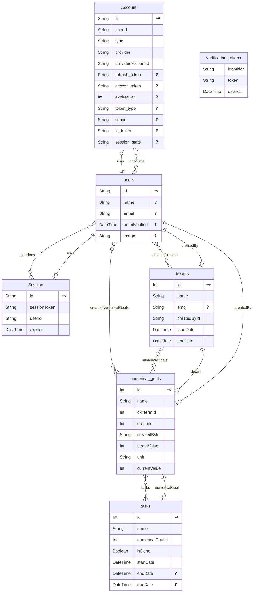

```mermaid
erDiagram

  "Account" {
    String id "🗝️"
    String userId 
    String type 
    String provider 
    String providerAccountId 
    String refresh_token "❓"
    String access_token "❓"
    Int expires_at "❓"
    String token_type "❓"
    String scope "❓"
    String id_token "❓"
    String session_state "❓"
    }
  

  "Session" {
    String id "🗝️"
    String sessionToken 
    String userId 
    DateTime expires 
    }
  

  "users" {
    String id "🗝️"
    String name "❓"
    String email "❓"
    DateTime emailVerified "❓"
    String image "❓"
    }
  

  "verification_tokens" {
    String identifier 
    String token 
    DateTime expires 
    }
  

  "dreams" {
    Int id "🗝️"
    String name 
    String emoji "❓"
    String createdById 
    DateTime startDate 
    DateTime endDate 
    }
  

  "numerical_goals" {
    Int id "🗝️"
    String name 
    Int okrTermId 
    Int dreamId 
    String createdById 
    Int targetValue 
    String unit 
    Int currentValue 
    }
  

  "tasks" {
    Int id "🗝️"
    String name 
    Int numericalGoalId 
    Boolean isDone 
    DateTime startDate 
    DateTime endDate "❓"
    DateTime dueDate "❓"
    }
  
    "Account" o|--|| "users" : "user"
    "Session" o|--|| "users" : "user"
    "users" o{--}o "Account" : "accounts"
    "users" o{--}o "Session" : "sessions"
    "users" o{--}o "dreams" : "createdDreams"
    "users" o{--}o "numerical_goals" : "createdNumericalGoals"
    "dreams" o|--|| "users" : "createdBy"
    "dreams" o{--}o "numerical_goals" : "numericalGoals"
    "numerical_goals" o|--|| "dreams" : "dream"
    "numerical_goals" o|--|| "users" : "createdBy"
    "numerical_goals" o{--}o "tasks" : "tasks"
    "tasks" o|--|| "numerical_goals" : "numericalGoal"
```
